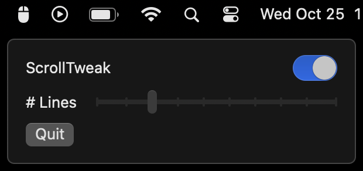

# Scroll Tweak

A macOS service that makes your mouse wheel scroll a fixed number of lines, regardless of velocity.
Comes with a menu bar icon that lets you configure its behavior.

This is useful for mice with coarse scroll wheels, which behave poorly in macOS by default.

Inspired by https://github.com/emreyolcu/discrete-scroll
